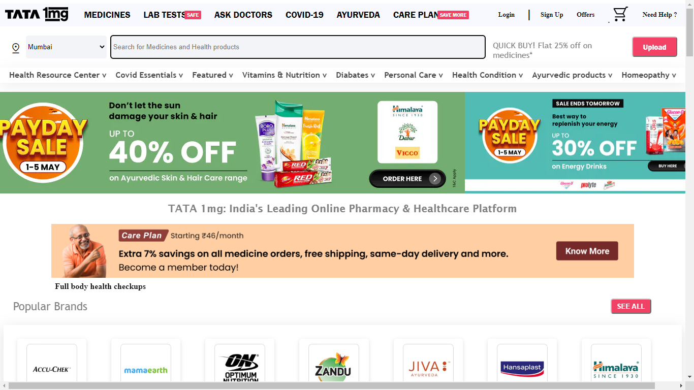
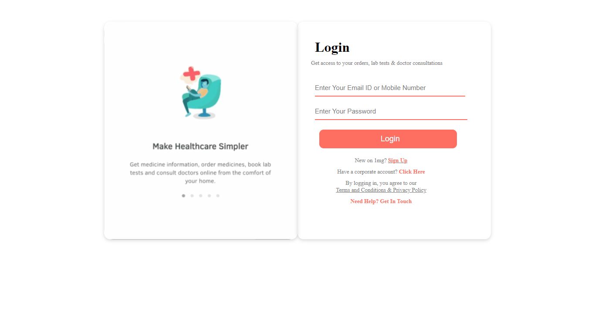
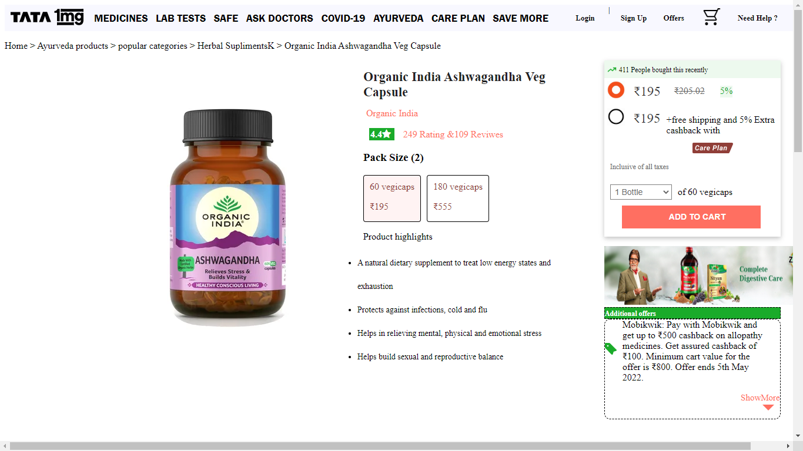
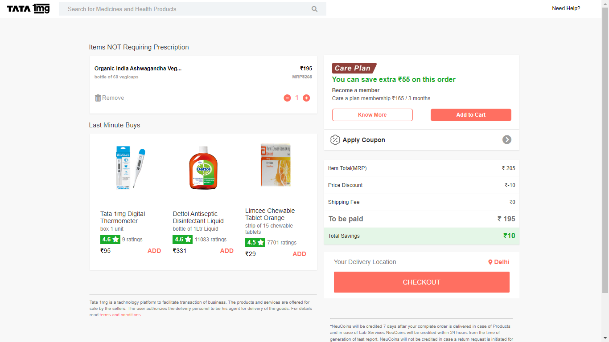
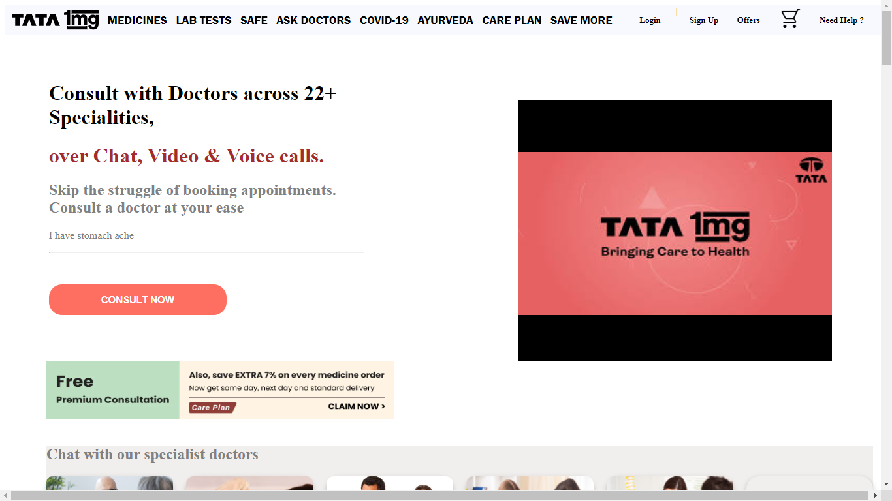

# Tata 1mg Clone

# About

- Tata 1mg is an E-Commerce website which is used to buy medicines or daily life products.
- This is a group project made during the construct week in Masai School.
- The features our website has are signin / login function, landing page, product description page, add to cart functionality, payment page.

## Tech Used

- HTML
- CSS
- JavaScript
- Git

## Links and Instalations

- Clone this repository [ link ](https://github.com/RohitSawant0351/TATA-1mg-Project) and host it in your local sever using index.html file inside Rohit folder.
- Netlify [ link ](https://tata1mg-clone.netlify.app/)

## Snapshots

### Home Page

### Login Page

### Product Description Page

### Payment Page

### Ask Doctor Page

